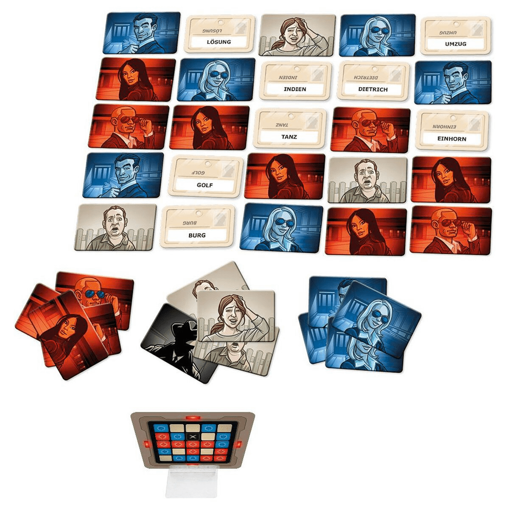

#  <b>Simulating Codenames with Natural Language Processing</b>

**Guillaume Hofmann, Amandine Tran**

**ENSAE, 3rd year**

Games are increasingly used as fields to apply Natural Language Processing techniques. *Codenames* is a popular Czech board game which is based on similarity between words. Two teams compete, each team having one "codemaster" and one or several guessers. 25 words (codename tiles) are placed on the table. The role of the guessers is to guess their team’s words, while avoiding the words belonging to the other team, to the assassin or to civilian squares. The guessers guess their words based on single-word clues given by the spymaster. 

In 2019, the *Codenames AI Competition* was organized. It consisted in confronting different types of codemasters and guessers bots to find the combination of players with the best victory rate. Therefore, using this competition as an inspiration, this project aims at creating a bot which can play this game, either as an guesser or as the codemaster.

# Main files

`Projet_NLP_ENSAE.pdf` is a short summary of this project.

`Projet_NLP_ENSAE.ipynb` gives greater details about our work and results. It is also available on [colab](https://colab.research.google.com/drive/1j3SJuoHfmnpGLrOpxjtT9wj2ne_SPiCw?usp=sharing).

`players/` folder contains source code used for our bots.

# Requirements

As this project is built upon the [codenames AI competition](https://sites.google.com/view/the-codenames-ai-competition/home), it is advised to follow this framework's installation requirements to run the code. These requirements are described on the following [github page](https://github.com/CodenamesAICompetition/Game).

Also, these files are required by bots based on GloVe and Word2Vec embeddings and should be unzipped and then added to the `players` folder. 
* [Glove Vectors](https://nlp.stanford.edu/data/glove.6B.zip) (~2.25 GB)
* [Google News Vectors](https://drive.google.com/file/d/0B7XkCwpI5KDYNlNUTTlSS21pQmM/edit) (~3.5 GB)
